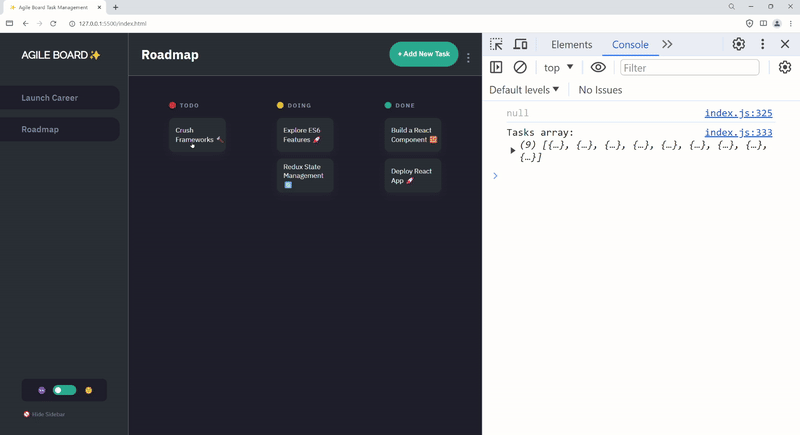
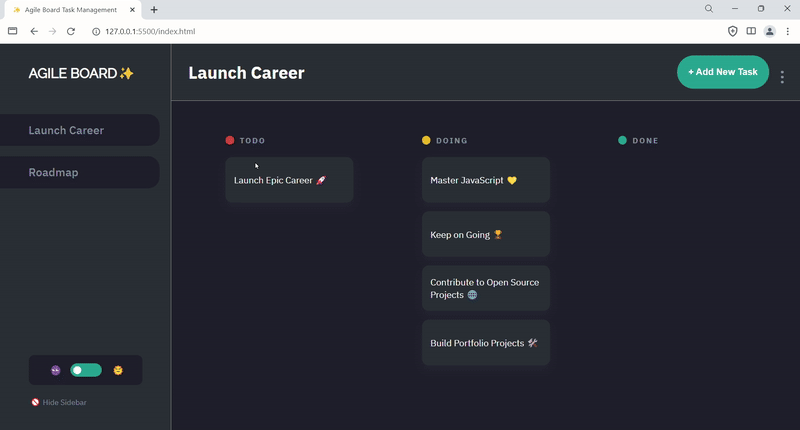

### [JSL11] Agile Board - Kanban Task Management App

Welcome to the Agile Board project, the final project for the JSL course! In this portfolio piece project, you will be stepping into the shoes of a juniour developer tasked with bringing a Kanban Task Management App to life. You're not starting from scratch, though. In this project, you are tasked with tackling the provided user stories to both identify and fix bugs in the code, as well as to develop your own functions to extend the application's capabilities. Key assignments include importing utility functions, initializing data, and diving into debugging tasks such as setting up data correctly in local storage, dynamically displaying boards and tasks, and enhancing user interactions.

Additionally, you will enhance the application by crafting code to meet specific functionalities outlined in the user stories, like managing task details and their lifecycle, toggling theme customization, and ensuring the persistence of data through local storage. This blend of debugging and creative coding invites you to apply your critical thinking and problem-solving skills in a hands-on manner, equipping you for the intricacies of real-world software development scenarios.

We're providing you with a head start:

- **Starter Code**: You will receive starter code for the user interface (UI) of the application. This includes the basic layout and some of the JavaScript (JS) functionality needed to make the app interactive.

- **Your Mission**: Your main task is to complete the app by implementing the features described in the provided user stories. These stories outline the functionality that users expect from the app, such as adding, editing, and deleting tasks, as well as customizing themes and managing the task lifecycle.

- **🪲Important Note on Debugging🚨:** In the sections of the project where you are tasked with debugging the code, *it's crucial to focus on identifying and correcting errors within the existing functions rather than undertaking a complete refactoring of the code.* This means you will need to carefully analyze the provided starter code to pinpoint syntax errors, logical mistakes, or any bugs that prevent the application from functioning as intended. **The goal is to improve and repair the codebase by making precise adjustments, ensuring that the original structure, function logic and intended functionality are preserved.** This approach not only aligns with the project's requirements but also hones the essential skill of debugging— a critical competency for any developer.

### Walkthrough by Coach Kenneth

Jump into the walkthrough of the project and starter code here: https://www.youtube.com/watch?v=aD8Wx9PGYSc

### Project Overview

As a newly hired developer at Agile Board, a fictional company specializing in innovative task management solutions, you'll embark on an exciting journey to enhance their flagship Kanban Task Management App.

Your journey through this project will involve several key activities:

1. **Exploring the Starter Code**: Begin by familiarizing yourself with the UI and JS functionality we've provided. This will give you a solid understanding of the project's current state and what needs to be done.
2. **Completing User Stories**: Dive into the user stories, which are your roadmap to completing the project. Each story is a feature or functionality that your app needs to support. Your goal is to write the JS code necessary to bring these stories to life.
3. **Testing and Debugging**: As you implement each feature, test your app to ensure it works as expected. Debug any issues that arise to ensure a smooth user experience.
4. **Reflecting on Your Work**: Once you've completed the user stories, take a step back and review your app. Consider the challenges you faced, what you learned, and how you might improve the app further.

This project is designed to be both challenging and rewarding, providing you with hands-on experience in web development. By the end, you'll have a functional Kanban Task Management App that you can showcase in your portfolio. Ready to get started? Let's dive in!

## What You Need to Do:

To complete this challenge, follow these steps:

1. Clone the provided Starter Code Repository to your local development environment: [Starter Code Repository](https://github.com/CodeSpace-Academy/Final_Project_StudentNo_Classcode_Group_Name-Surname_JSL11).
2. Open the cloned project in your code editor.
3. Code your solution to the user stories.
4. Commit your changes to your local Git repository with meaningful commit messages.
5. Push your local Git repository to your GitHub account.
6. Verify that the changes have been successfully pushed to your GitHub repository.

🚨 Make sure that you clear the localStorage as you are building your project. This will help with checking that the tasks are loading correctly. 

## What You Need to Include:

1. Ensure that your code includes the necessary modifications to meet the challenge requirements.
2. Your GitHub repository should contain the updated code files.

# Agile Board Project Feature List

In this Agile Board Project Feature List, you're introduced to a comprehensive suite of functionalities designed to enrich your Kanban Task Management App. 

As you embark on implementing these features, remember the value of tackling the project one small task at a time. This approach not only makes the process more manageable but also ensures that you can focus on the quality of each feature, leading to a more robust and user-friendly application. Your journey through this project is a great opportunity to apply and hone your skills, so take it step by step and enjoy the learning experience.

# Task Interaction and Detail Management
- **Clicking an Individual Task for Details**: As a user, I want to click on an individual task so that I can view its details and make edits if necessary.
- **Opening the Task Edit Modal**: As a user, I want to open a modal window when adding or editing tasks to easily input task information.
- **Updating the Task Title**: As a user, I want to update the task title within the modal to change how it’s displayed on the board.
- **Updating the Task Description**: As a user, I want to update the task description within the modal so I can better describe what needs to be done.
- **Updating the Task Status**: As a user, I want to update the current status of a task (todo, doing, done) to track its progress.
- **Saving Task Changes**: As a user, I want to save the changes I make to a task so that the updated details are stored and displayed.
- **Updating the UI with Task Changes**: As a user, I expect the changes I make to a task to be reflected immediately on the UI without needing to refresh.
- **Deleting a Task from the Edit Modal**: As a user, I want the ability to delete a task directly from the edit modal if it’s no longer needed.
- **Canceling Edits Without Saving**: As a user, I want to be able to cancel my edits and close the modal without saving to avoid accidental changes.
- **Editing Task Details**: As a user, I want to edit the details of an existing task to correct or update information as needed.
- **Easy Navigation Between Task Statuses**: As a user, I want to easily move tasks between statuses (todo, doing, done) to reflect their current progress.
- **Viewing Task Details**: As a user, I want to view detailed information about a task to understand its scope and requirements fully.

# Task Deletion and Confirmation Mechanisms
- **Clicking "Delete Task" Button**: As a user, I want to click a "Delete Task" button within the task edit modal so I can remove tasks that are no longer necessary.
- **Immediate UI Update on Task Deletion**: As a user, I expect a task to disappear from the UI immediately after I confirm its deletion to reflect the current state of my task list.

# Theme Customization
- **Switching to Dark Mode**: As a user, I want to switch to dark mode so that I can reduce eye strain in low-light conditions.
- **Switching Back to Light Mode**: As a user, I want to switch back to light mode from dark mode to better suit bright environments and see the logo update accordingly.

# Managing the Sidebar
- **Hiding the Side Bar for More Workspace**: As a user, I want the ability to hide the side bar to gain more workspace.
- **Opening the Side Bar for Navigation and Options**: As a user, I want to easily open the side bar to navigate between boards.

# Task Lifecycle Management
- **Clicking "Add New Task" to Start Adding a Task**: As a user, I want to click the "Add New Task" button so I can begin the process of adding a new task to my board.
- **Modal Opens for New Task Input**: As a user, I expect the modal to open when I click "Add New Task" to provide me with a form to input the task's details.
- **Adding a Title to the New Task**: As a user, I want to be able to add a title to my new task so I can clearly identify it on the board.
- **Adding a Description to the New Task**: As a user, I want to be able to add a description to my new task to provide more details about what needs to be done.
- **Selecting a Status for the New Task**: As a user, I want to select a status for my new task (e.g., Todo, Doing, Done) to categorize it based on its progress.
- **Creating the New Task**: As a user, I want to click a "Create Task" button in the modal to save the new task to the board.
- **New Task Appears in UI Under Correct Status**: As a user, I expect the new task to appear in the UI under the correct status column immediately after creation.
- **Viewing New Task Details**: As a user, I want to view detailed information about the New Task to understand its scope and requirements fully.
- **Editing New Task Details**: As a user, I want to edit the details of the New Task to correct or update information as needed.

# Local Storage and Data Persistence
- **Saving New Tasks in localStorage**: As a user, I want my newly created tasks to be saved in localStorage so that my tasks persist even when I close or refresh the browser.
- **Reflecting Task Updates in localStorage**: As a user, I expect tasks that I update to have their changes reflected in localStorage so that any modifications are not lost.
- **Removing Deleted Tasks from localStorage**: As a user, I want tasks that I delete to be removed from localStorage so that my task list remains accurate and up-to-date.
